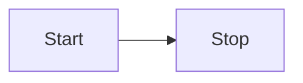

# Markdown

A simple program to view markdown files on your computer.

It provides

- styling
  - responsive,
  - light and dark theme,
- links to local files,
- markdown features
  - syntax highlighting,
  - TexMath,
  - mermaid diagrams,
- hot reloading,
- ~~directory scanning~~,
- ~~printing~~.



```typescript
const test = 123;
```

$$
c = \pm\sqrt{a^2 + b^2}
$$
